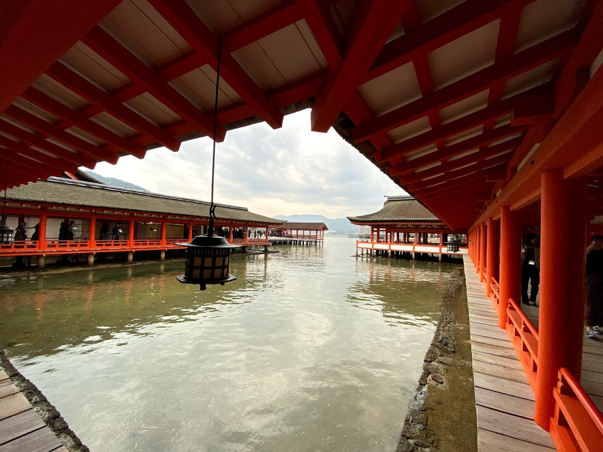

# Our Awesome 30th Anniversary Trip to Japan

In late October of 2019, Sue & I traveled to Japan for our (delayed) 30th
anniversary trip.  We had an amazing time.  This is a blog post about our
adventures.

## First Stop -- Tokyo

We flew on Friday evening, 10/25/2019, to Haneda airport.  The flight (which
was on ANA) took off three hours late for no obvious reason, and landed two
hours late.  Imagine our shock when, after clearing customs, ANA employees
flagged us down and gave us each 15,000 Yen (around $150 each) as compensation
for a late arrival!

As it was nearly midnight on Saturday night, we just went to our hotel (the
Century Southern Tier, located conveniently at the Shinjuku train station), and
went to sleep.

### Sunday October 27

In the morning -- first thing we did was to open the shades and take a look at
the view of the area.  The hotel was right above Shinjuku station, the busiest
train station in the world, serving 3 million people every day!

Our first stop that morning was the Senso-Ji Buddhist temple in the Asakusa
neighborhood.  We will talk about shrines and temples a lot, so here is a helpful
guide.  Japanese people seem to be mostly observing both Buddhist and Shinto
traditions.  There are many Buddhist temples (indicated by -Ji in the name)
and many Shinto shrines (indicated by -Jinju in the name).  Many Japanese go
to both, usually for different types of life events.  

Then we headed over to the Akihabara neighborhood (the electronics and Manga
capital of Tokyo) for a free walking tour of the area.  On the way we stopped
for "conveyor belt sushi".  It cost like $20 for the 2 of us and was some of
the best sushi I ever remember having!

Our tour with Hiroshi (the company: Tokyo Localized) was great.  And he was so
entertaining and informative.  We learned about the general background/history
of Japan -- including the Edo period (isolationist Shogunate 1603-1860's) and
the Meiji restoration (1868-).  This put in context the importance of Kyoto
(emperor's capital) and Tokyo (more the Shogunate's capital).

We visited the "Akihabara" neighborhood -- which is known for electronics and
Manga/Anime.  In this neighborhood we saw many "Otaku" (anime geeks), and we
learned about AKB48 (look it up -- it's either a girl band or a reality show,
depending on how you look at it), and the bizarre concept of "Maid Cafe's",
where the staff dresses like French maids and calls the customer "master".
Note: customers are men *and* women *and* often whole families!!

On the tour, we also saw a Shinto shrine (Kanda Myoujin), a Confucian temple,
and had some amazing soft serve ice cream (not the only time this happened in
Japan -- and I usually dislike soft serve ice cream).  At Kanda Myoujin, we
learned about the practice of washing hands, writing wishes on tablets (for a
fee), getting fortunes, and more importantly: what you do when you receive a
bad fortune.  The answer is -- twist it around the bad-fortune tree and leave
it behind!

We walked through a shopping street called Ameyoko Ueno (in Ueno) which
started as the black market immediately post war, but then became a large
regulated market selling everything.  We ended the tour at the statue of
the Last Samaurai, in Ueno park.  I would highly recommend this "Tokyo
Localized" flagship free walking tour and the tourguide, Hiroshi, too!

### Monday October 28

We started our day with a walking tour of Meiji-Jinju and Harajuku, led by Emi
of Tokyo Localized (again).  Started with Meiji shrine — in a beautiful tree
lined setting.  

Here we learned about some of the rituals that Japanese families perform in
shrines, such as the 3/5/7 ceremonies where they bring their children at the
ages of 3, 5, and 7.

Then Takeshita Street — crazy street lined with sweet food and cute stuff and
some goth all seemingly targeted towards Japanese teen girls — kind of crazy.

After the tour, we headed over to the traditional coffee house Chatei Haitou.
Absolutely amazing coffee!! He used a Kalita Wave, by the way.  Probably the
best pourover I've ever had.

From there we waked around the Shibuya area -- saw Shibuya Crossing, an amazing
5-way intersection with waves of people crossing each light.  Next to Shibuya
Hikarie department store.  Then walked back to our hotel via Yoyogi Park /
Meiji Jinju.

Dinner at "Udon Shin", a tiny udon place in the back streets of Shibuya.  You
order before you even get seated.  A great cheap dinner!  That evening we
walked over to Tokyu Hands, a multi floor department store with one floor
dedicated just to crafts and home projects!

### Tuesday October 29

First thing, we went to meet with artist Kazuko Shihashi.  We had been
introduced to her work by Ali Hacket's friend Kamala in London.  We met her,
her daughter, and a man who was teaching her to perform tea ceremonies.  After
viewing her work she actually performed a ceremony for us.  It was very
beautiful!!

Next stop was the "Borderless Labs" interactive art exhibit.  Very cool
walk-through-it art.  Back home to the hotel and had sushi on the restaurant
floor of "Shinjuku Times Square".

###  Wednesday October 30

In the morning we visited the East Gardens of the Imperial Palace grounds.
Afterwards we went up to the Lawn.  They were literally building a small
village, specifically for a ceremony which takes place on the change of
emperor!  I mean a whole village for one ceremony.

Afterwards we walked to Ginza and saw Sony Square and Ginza crossing. We
visited Itoya, a 12-floor stationery store!  Bought some cards and had lunch
at the cafe on top floor.

Then on to Cafe de l’ambre — another "OG" coffee shop of Tokyo. Aged beans
(!?). The coffee servings were much smaller than Chatei Hatou and the place was
much more cramped and rushed.  I also think the coffee was just objectively
better at Chatei Hatou. 

We then visited Hama-rikyu gardens. Previously these were shore recreational
lands of the Shoguns, and then reverted to the Emperor after the restoration.
Now it's a public park. In the park there are carefully researched and
reconstructed tea houses and other buildings. 

But the highlight of the day was definitely the Night tour of Shinjuku.  First
Memory Lane AKA "Piss Alley" — yakitori and beer in dozens of tiny places in a
smoky alley.  

Then Kabuki Town  — restaurants mainly with also people outside recruiting
customers for some other Yakuza-owned places.  Stay away from them!  Then Red
Light District -- we learned about the 5 different kind of sexual services
mostly legally available: massage, escort, (two others I forget), and Soap
Houses.  Prostitution is illegal but weirdly this just means money for
intercourse. Other sex stuff is legal -- and there are even "information
bureaus" where you can go to find what you want based on your preferences!  

Then there are host (or hostess) clubs. No sex. Just "girlfriend experience"
(or boyfriend). Hugely expensive and most famous boy made 2.2M$ in a year. 

Then Love hotels: 2 hours, 6 hours, overnight. Very commonly used by Japanese.
Most have been for various reasons. Finally Golden Gai — 100 small (ten person)
themed bars which are pretty much the only place Japanese who are not in the
same group will speak to each other.  (Otherwise it's considered rude to
"abandon" your friends or co-workers.)

This wrapped up Tokyo for us.  A great ending to an amazing 5 days.

## Next Stop, Hakone and the Foot Hills of Mt Fuji

In the next phase of our trip, we spent time in a more rural area, in the
foothills of Mt. Fuji.

### Thursday October 31

On Thursday morning we got on a JR "Shinkansen" (bullet train) and headed to
Odawara station.  Almost didn't get off in time!  Thence to a local train to
Hakone, and then a taxi to our "semi-traditional" hotel -- the Manatei spa.
Like a Ryokan (traditional hotel) -- but with beds!

The first thing we did after checking in, was to check out the Hakone Open Air
Museum.  Many really great sculptures including a whole Picasso section.  All
in a beautiful setting in the mountains.  We used buses to get around -- and
they were amazingly easy to use, with a "SUICA" (IC) card, english
announcements, and great coverage in google maps.

The scale of the garden, and it's magnificent setting, is breathtaking.

This is just one of so many really outstanding sculptures:

If you go, definitely climb the stunning stained glass tower:

We really loved this place!

That evening we went back to our hotel, where we were given traditional garb.
We "dressed for dinner".  We had a private room in the restaurant, and had a
multi-course (12 courses?) traditional "Kaiseki" meal.  They were very careful
about our dietary restrictions -- and we could eat absolutely everything!

### Friday November 1

On Friday morning we headed out to catch a bus, to a cable car (which we would
call a funicular, to a "rope way" (which we would probably call a cable car or
gondola, and got amazing views of Mt Fuji as we traveled.  The vehicles made
multiple stops and one could get off and walk around.

We passed over a smoking volcanic field -- kind of looks hellish!  It was not
possible to get off there due to excess volcanic activity.

Ultimately we landed on the shore of Lake Ashi.  We took a boat across the lake
to Hakonemachi.  There we took a quick look at the "Shogun Checkpoint museum".
During the Edo period the Shoguns kept a checkpoint at this mountain pass.
Oddly one of the key reasons for the checkpoint was to ensure that the wives of
the Daimyo (vassal shoguns of outlying regions) did not escape from Edo (Tokyo)
where they were being held as hostage to guarantee the fealty of the Daimyo.

We walked along the shore of Lake Ashi to MotoHakone and then continued on.  We
visited the Hakone shrine there.

Ultimately we grabbed a bus and returned to our hotel.  We visited the Onsen
(hot bath).  We chose the "private family baths", since we are not too
interested in public bathing.  Afterwards we we had another amazing Kaiseki
meal.

## Hiroshima and Miyajima Island

Phase II of our trip -- Hiroshima Area.  The goal is just to see the museum and
the sights related to the bombing while in Hiroshima, and then visit the lovely
Miyajima Island nearby.

### Saturday November 2

Saturday morning we took a taxi to Odawara station and caught the Shinkansen to
Hiroshima via Shin-Osaka.  Because we did not have a reservation, and it was a
very busy weekend (due to Culture Day in Japan), we had to stand almost all the
way to Shin Osaka!  (90 minutes or so).  

When we arrived in Hiroshima we checked into our hotel -- the Granvia at
Hirohshima station.  We had heard of a site called the "Manga Reading Room" and
tried to visit it, but due to a misread of Google Maps, ended up in the Manga
section of a small public library in the suburbs of Hiroshima.  But it was
interesting to travel through and see what those suburbs looked like.  We also
learned a bit about how popular the Manga form is for reading material in
Japan.  It is even used to teach educational topics sometimes.

That evening we walked in "Peace Memorial Park" and saw the Bomb Dome memorial.
This is a building right under the epicenter of the blast, which survived and
is now left in place as a memorial.  Very spooky.

We walked around the area and ended up having dinner at a Mazeman Raman (dry
raman) place called Okkundo Otemachi.  Was a tiny place but really good and
cheap and the staff was super nice!  (It's well rated on Trip Advisor BTW.)

### Sunday November 3

We started the day with the Hiroshima Peace Memorial Museum.  Reall, how to
describe this.  The most similar feeling I can remember is when I've visited
graphic Holocaust memorials.  The human suffering involved is unimaginable but
the museum does a good job of causing you to confront this.  Really they manage
to focus on the importance of peace and show surprisingly little bitterness
in their exhibits, both human and historical.

Afterwards we ate "Okonomiyaki" pancakes in Hiroshima Station for lunch.  Oko
is really almost any combination of (normally savory) ingredients, often
involving noodles and cabbage, often pork (not for us), and egg.  They are
pervasive and made different ways in different cities.  (We ended up having
very different Oko in Kyoto with Howard and Hitomi later in the trip.

Next we took the train and then a ferry to Miyajima.  We saw the Itsukuru
"floating" shrine.  Unbelieveably packed!  

Fortunately we were staying on the island so we didn't have to leave that
night, which meant we were able to stick around til things quieted down.  We
walked around in the evening along the shoreline.  Interesting observation:  a
guy cleaning his dog's butt.  I mean they are just so clean here.

Next we went up the hill toward the really amazing Daisho-In temple up the
hill.  (Probably my favorite Buddhist Temple of the trip.)  

Sue loved the little Buddha's wearing knitted caps -- which we ended up calling
Jewdas because their little caps looked like kippot!

We then had a course traditional dinner at hotel.  Though I'd have to say the
one at Manatei in Hakone was better.  We had a boat ride at night. All in
Japanese but nice to be on the water in the brisk night.  Finally back to the
hotel for a quick onsen foot bath wearing our hotel-provided kimonos. 

### Monday November 4

The next morning we woke up early to get a start before the morning rush of
tourists arrived.  We took the ropeway to Mt Misen. Really beautiful 360 views.

We hiked down by way of the Daisho In temple.  Sue got a chance to take like
100 more shots of the Jewdas.

We then headed back by ferry and train to Hiroshima, and caught the Shinkansen
to Kyoto.  We arrived at Kyoto Station in the late afternoon and checked in to
the Granvia hotel at the station.  Very reasonable cost and really probably the
best "standard" hotel we stayed at on the trip.  We took a trip along the
11-floor outdoor escalator to see the majestic station and the Isetan
department store, a quick dinner at the hotel restaurant and then to bed.

## Kyoto -- and family!

By now we had had some amazing adventures and were very excited for the final
phase of our trip: a chance to spend time with cousins Howard and Hitomi
Levine, and getting a chance to see the Kyoto area through their eyes.

### Tuesday November 5

On Tuesday morning, Howard and Hitomi came by our hotel, and we had breakfast
at the Ogawa Coffee in Kyoto Station.  Ogawa has some great coffee!  And they
also sell something called a "morning set", with hard boiled egg, Portuguese
style "pan" toast, a small salad, and coffee, all for a low price.  We ended
up coming here and grabbing this same breakfast every day for the rest of the
trip!  Never got tired of it really, and I repeat -- the coffee was excellent.

The first adventure we had started minutes later.  The Isetan department store
opens at 10:00AM, and H&H told us "you must come see this -- it's an experience
you can only have in Japan".  We stood at the glass front door of the store and
-- at 9:59, employees started running around inside the store.  At precisely
10:00am the store opened, and as we walked in, dozens of employees bowed,
greeting us good morning.  As we walked around the departments of the store,
this was repeated over and over.  Such an unusual experience!

Our next stop was the Fushimi Inari shrine.  A very large and popular Shinto
shrine -- with hundreds of orange gates.  Sue was reminded of the "Gates"
installation in Central Park, and we learned that that installation had been
inspired by this Shrine.

We then walked in the Pontocho (former Geisha) district.  We had lunch at a
soba restaurant in the basement of a nearby hotel.  Then we headed over to
Teramachi street -- a covered arcade-style market in the center of town.

Later we had dinner at an amazing "Shabu Shabu" restaurant, and I had my first
taste of Wagyu beef.  The food, and especially the beef, was excellent, and it
was fun (and beginning to seem typical) to cook the food at our table.

### Wednesday November 6

On Wednesday morning, Howard met us at the hotel.  Hitomi stayed back at her
mom's house as they were shopping together and preparing for a meal later in
the day (see next).  

Our first stop was the Buddhist temple Kiyomizu Dera.  Here a new experience
was walking in a pitch dark tunnel, to simulate being reborn.  (?)

Our next stp was the huge Yodabashi electronics store.  Eight floors of
electronics including "8K" TV's.  

We then went to H&H's neigborhood -- Arashiyama.  There we walked across the
Togetsu Kyou bridge (over the Katsura river).  Then to Iwatayama Park (or
"Monkey Mountain" as Howard calls it).  There we saw so many monkeys playing
and grooming each other.  They are apparently "research monkeys", but we do
not know what that means.

From there we walked to, and through, the Bamboo Forest.  A Bamboo Forest right
in the middle of a suburb!  

We then walked through the surrounding neigborhood to Hitomi's parents' house
in the Saga Torimoto neighborhood.  We got to meet Hitomi's mom (her dad lives
separately in Osaka most of the time due to work).  For dinner we had "Teppan
Yaki" (cooked on a large griddle in the middle of the table).  The food was
delicious, and we had more Wagyu beef.  The best "Omi" Wagyu.  And the best
beef I've ever eaten in my life by far.  I think I am spoiled now and wonder
whether I will ever eat beef in America again.  I mean, I probably will, but
it's hard to imagine that I won't compare it to this every single time.

Later that night we walked back from the house to Saga Arashiyama train station,
and took a train straight back to the hotel.

### Thursday November 7

Thursday was a packed trip to Nara.  Howard drove, and we hit the three major
sites:

* Todai Ji -- the world's largest Buddha.  
* Horyu Ji -- the world's oldest wooden structure.
* Chugu-Ji -- the "Mona Lisa" of Japan in an ancient temple.

All around Nara the deer roam wildly.  If you buy "deer crackers", somehow they
know and come after you very aggressively!

Later that evening we had dinner at a restaurant right in the Saga Torimoto
neighborhood (I think).  We had our own private room and I think we may have
been the only customers just then.  A multi-course "Kaiseki" dinner with great
wine.  So lovely to have a chance to just sit and talk with Howard and Hitomi.
We really never get tired of it.

### Friday November 8

On Friday we hit a few more key sites in Kyoto.  The "Golden Pavilion" -- a
Buddhist Temple plated in gold (!!).  In a lovely setting made even lovelier by
the foliage.  Thence to the Buddhist Rock Garden.

After seeing the sites, we went to Howard and Hitomi's lovely apartment in
Arashiyama, not far from the Togetsu Kyou Bridge, with a lovely view of the
bridge and the Katsura river!  

From here we grabbed a train to Osaka.  We had Okonomiyaki in a Kyoto style,
cooked at our table, as a quick lunch.  Then we went shopping at the Hankyu and
Daimaru department stores while H&H had a meeting with Hitomi's dad at his
office. 

Afterwards, we had the absolutely most amazing sushi at a place near the Osaka
train station.  H&H knew the chef from many visits there in the past, and he
certainly treated us well.  Certainly the best sushi we have ever had!  Oh no
-- I think now we will be comparing every sushi meal we have in New York to
this one.

### Saturday November 9

On Saturday morning we got a late start, and did a bit of shopping for
souvenirs at Isetan.  While we were there we went out on the "skyway" and saw a
great view of Kyoto.

Next we went to the Kyoto Railway Museum, run by JR.  Absolutely the most
amazing railway museum I've ever seen.  Loved it and learned a lot!  Of course
I could have stayed there all day.

Then we went to H&H's apartment and had an awesome "super fresh tofu" lunch,
and then went shopping near the Togetsu bridge.  So crowded!  We made a quick
visit to the Tenryu-Ji zen temple, and then headed over to dinner.

Dinner was an absolutely unbelievable Wagyu beef dinner (sorry Sue you had to
settle for fish!) at the restaurant rated by Japanese people as the #1 Wagyu
place in Kyoto.  We sat at a counter and watched as an old man and his family
prepared our dinner before us.  The beef was exceptional.

This meal together was a great way to cap off an amazing six days together!  We
are so glad to have had the chance to spend time with Howard and Hitomi, both
for the amazing opportunity to see Japan through their eyes, but also just to
be together, and deepen our relationships!

## Time to Head Home

On Sunday November 10, we said a fond goodbye to Japan.  We headed back on the
Shinkansen to Shinagawa and then through to Narita airport on the Narita
Express.  Perfectly on time.  Trains are amazing in this country!!  The flight
home was very smooth, but we will miss Japan and this amazing experience!

